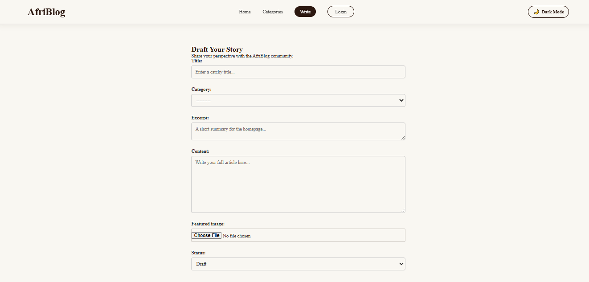
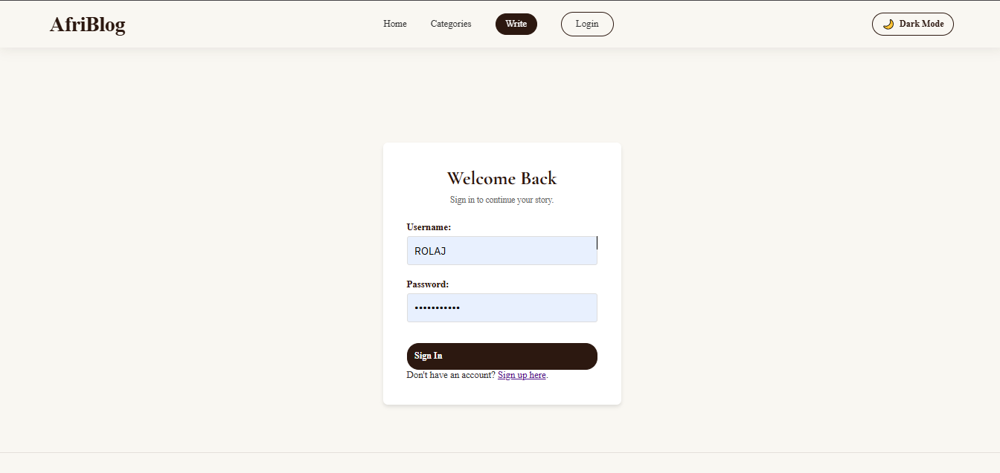
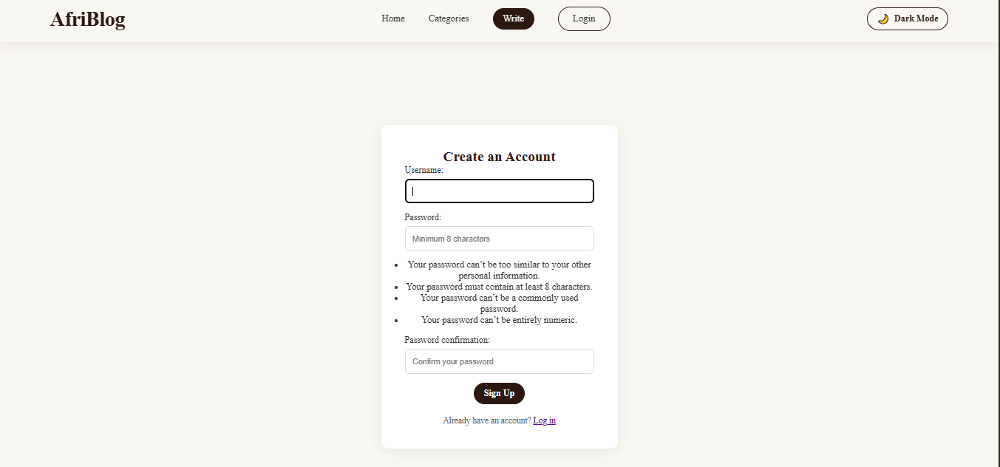
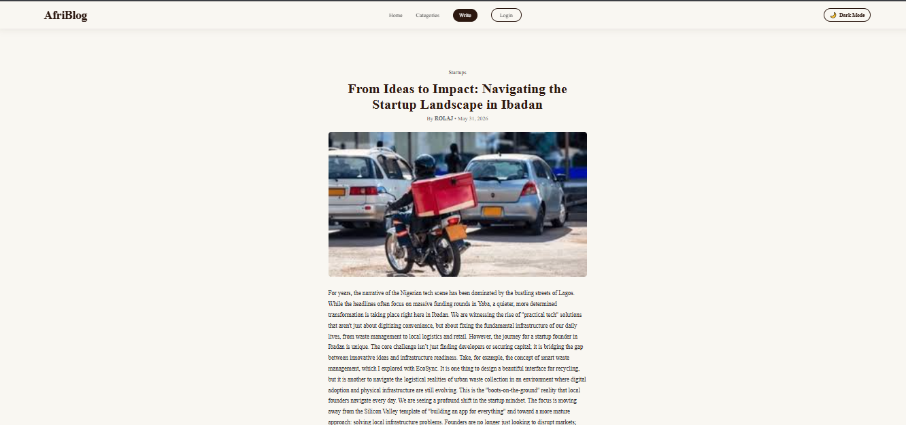
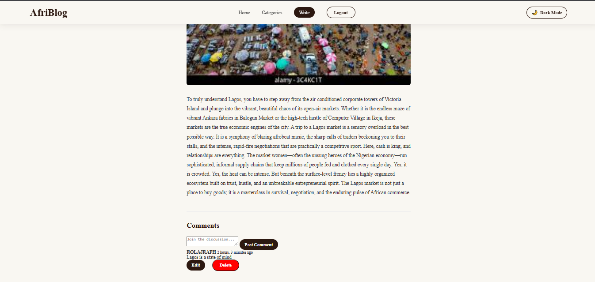

AFRIBLOG
Project Description
AFRIBLOG is a full-stack web application built with the Django framework, designed to serve as a platform for bloggers to share content and engage in community discussions. The platform features robust CRUD functionality, including post creation, editing, and deletion by authorized authors, as well as an interactive comment section with user-specific moderation tools. It is tailored to provide a seamless blogging experience with a focus on user engagement and content management.

Features
User Authentication: Secure login and registration.

Post Management: Users can create, update, and delete their own blog posts.

Comment System: Registered users can post, edit, and delete their own comments, while staff members maintain moderation control.

Responsive Design: A clean, accessible layout for reading and interacting with content.

Setup Instructions
Prerequisites
Python 3.x installed

Git

Virtual environment tool (e.g., venv)


Installation Steps
Clone the repository:

git clone [(https://github.com/Rolajraph/AFRIBLOG)]
cd AFRIBLOG

Demo Presentation
Check out the project in action here:
[Link to your demo presentation video]


2.  **Create and activate a virtual environment:**
    ```bash
    python -m venv venv
    # Windows:
    venv\Scripts\activate
    # macOS/Linux:
    source venv/bin/activate
Install dependencies:

pip install -r requirements.txt


4.  **Run migrations:**
    ```bash
python manage.py makemigrations
python manage.py migrate
Create a superuser (for admin access):  

python manage.py createsuperuser  


6.  **Run the development server:**
    ```bash
python manage.py runserver
*Access the project at `[http://127.0.0.1:8000/](http://127.0.0.1:8000/)`*


## Screenshots

### Blog Homepage


### write page


### login page


### signup page


### reading page


### comment section



